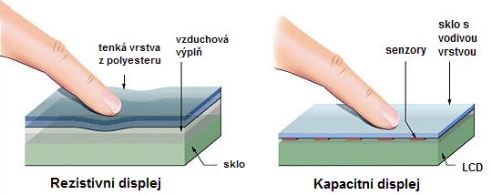
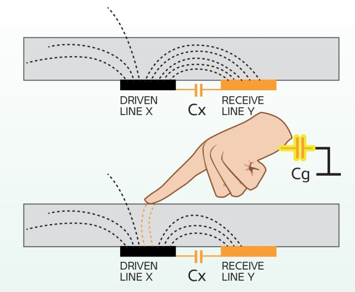

# 14. Mobilní zařízení
> Druhy mobilních zařízení \
> Funkce \
> Mobilní sítě

## druhy zařízení
- PDA (Personal Digital Assisant)
  - předchůdce mobilních telefonů
  - organizace věcí - kalendář, poznámky, atd.
  - čtečka bar/QR kódů
  - nyní většinou nahrazené smartphony
- mobil (telefon)
  - dříve jen na volání, pak sms, pak všestrannost
  - komunikace, organizace, zábava
- čtečka
  - zobrazování textových dokumentů (a občas i obrázků)
  - e-ink displej oproti LCD displeji
    - příjemnější - nesvítí do obličeje
    - menší spotřeba - žere pouze změna obrazu (výdrž jsou týdny)
    - často jen černobílý
    - pomalý
- notebook
- MP3 přehrávače

## druhy displejů
- rezistivní
  - dvě vodivé vrstvy (mezi nimi je vzduch)
  - při dotyku se propojí a začne procházet el. proud
  - počítač vyhodnotí bod dotyku
  - ovladatelné prakticky čímkoliv
  - levné, jednoduché
  - pouze jeden dotyk
  - malá průzračnost, menší odolnost (fyzické pomáčknutí)
- kapacitní
  - přirozená vodivost těla
  - displej je potažen vodivou vrstvou
  - při dotyku se uzavře odpor
    - detekce kapacitance
  - vysoká odolnost, více dotyků

- e-ink
  - miniaturní kapsle s černou a bílou barvou
  - mezi dvěmi nabitými vrstvami
  - dle náboje barvy půjdou k jedné nebo druhé vrstvě
  - s filtry možné RGB

## mobilní sítě
- celulární
  - nejčastější
  - 4G
    - čistě přes IP - neodděluje hlas a ostatní data
  - 5G
    - malé přenosové věže
    - mnohem větší přenosová rychlost
- satelitní
  - užitečné v odlehlých oblastech kde není infrastruktura
  - použitelné při katastrofách

