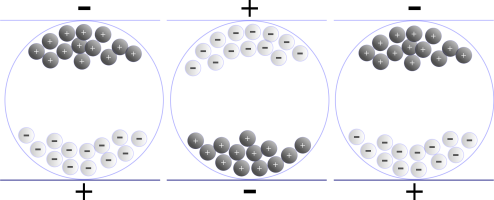

# 14. Mobilní zařízení

> Druhy mobilních zařízení \
> Funkce \
> Mobilní sítě

## Definice

- Počítač dostatečně malý na to, aby ho šlo používat v ruce
- Typicky na baterku, placatý displej, často dotykový
- Mobily, tablety, notebooky, foťáky, čtečky, navigace, kalkulačka, konzole, chytré hodinky / náramka, MP3 přehrávač...

## Druhy mobilních zařízení

### PDA (Personal Digital Assisant)

- Předchůdce mobilních telefonů
- Malý kapesní počítač - Často dotyková obrazovka ovládaná stylusem
- Především pro kancelářské účely - Kalendář, kontaky, poznámky, kalkulačka, email...
- Dnes nahrazené mobily
- Např. Apple Newton, Palm Pilo

### Mobil (chytrý telefon)

- Původně pouze telefonníí hovory, SMS A MMS, pozdějí i internet
- Dnes všestranný přenosný počítač
- Typicky dotykový displej, (většinou) armový procesor
- Operační systémy Android, Mobian, Arch Linux ARM, iOS
- Výrobci Samsung, Apple, Xiami, Huawei, Lenovo, Sony...
- Pro komunikaci, zábavu, multimédia, práce...

### Tablet

- Mobil, ale s větší obrazovkou (někdy bez telefonní sítě)
- Dnes již méně populární - Hlavně účelové využití jako např. pro grafiky

### Eelktronická kniha (čtečka)

- Digitální ekvivalent tištěné knihy
- Určené k zobrazování textových dokumentů (a občas i obrázků)
- Většinou dispej na bázi e-inku
  - Oproti např. mobilu při čtení delší výdrž baterie a příjemnější čtení

#### E-ink

- Technologie displejů, které velmi připomínají papír
  - Příjemné pro oči - Nesvítí do obličeje
  - Nízká spotřeba - žere pouze změna obrazu (výdrž jsou týdny)
  - Často jen černobílý
  - Pomalé překreslování
- Princip
  - Pixel tvoří miniaturní kapsle s černou a bílou barvou mezi dvěmi nabitými vrstvami
  - Dle náboje vrstvy jsou přitaženy barvy v kapsli k jedné nebo druhé vrstvě
  - Použitím filtrů lze vytvořit i více barev
- Sám o sobě nepodsvícený - Po tmě nečitelný

## Druhy dotykových displejů

### Rezistivní

- Dvě vodivé vrstvy (mezi nimi je vzduch)
- Při dotyku se propojí a začne procházet proud proud
- Počítač vyhodnotí bod dotyku
- Ovladatelné prakticky čímkoliv (např. i v rukavicích)
- Levné, jednoduché
- Může detekovat pouze jeden dotyk naráz
- Malá průzračnost, menší odolnost (fyzické pomáčknutí)
- Na dotyk "divný"

### Kapacitní

- Displej je potažen vodivou vrstvou
- Při dotyku se uzavře odpor
  - Detekce kapacitance prstu
  - Využívá přirozenou vodivost těla (funguje pouze s vodivými předměty)
- Vysoká odolnost a citlivost, detekuje zároveň více dotyků
- Dnes zdaleka nejpoužívanější

## Mobilní sítě

### Definice

- Síť, jejíž uživatel není vázán místa, kde je přípojka (drát)
- Nepoužívá připojení drátem, ale elektromagnetické záření (většinou rádiové vlny, ale také např. lasery)

### Celulární rádiová síť

- Komunikaci s zařízením zajišťuje množství záklanových stanic (vysílačů)
- Sítě nulté až páté generace
  - 2G - GSM
    - Přechod na plně digitální komunikace
    - Vedle (digitálních) také SMS, hlasová schránka, mobilní data (internetové připojení)
  - 3G
    - Větší rychlost připojení, kvalitnější zvuk
  - 4G (+LTE)
    - Zvýšení rychlosti připojení
    - Nahrazení trandiční telofonové infrastruktury IP
  - 5G
    - Mnohem větší přenosová rychlost (až 10 Gbit/s) a nižší latence - Díky většímu množství menších základnových stanic
    - Využítí v internetu věcí, průmyslu...
    - Nezpůsobuje rakovinu

### Satelitní telefon

- Nepřipojuje se k základnové stanici, ale k satelitu
- Dovoláte se kdekoliv na Zemi - Hodí se např. v odlehlých oblastech, přírodních katastrofách
- Drahé

### Satelitní internet

- Připojení k internetu zprostředkována přes satelit na nízké oběžné dráze
- Hodí se v rozvojových zemích, kde nemají infrastrukturu, nebo v zemích, kde jim infrastrukturu rozstříleli rusové
- Starlink (SpaceX), Globalstar, Iridium...
