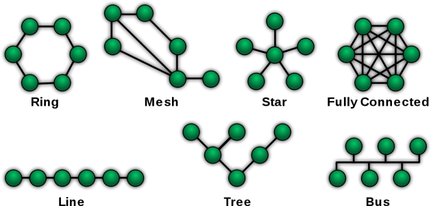

# 16. Topologie počítačových sítí

> Druhy sítí \
> Prvky sítě

## Topologie počítačových sítí

### Definice

- Vychází z teorie grafů
- Popisuje uspořádání síťových prvků v počítačové síti
- Fyzická topologie
  - Zabývá se reálnou konstrukcí sítě
  - Jak a k čemu jsou připojena jednotlivá zařízení sítě, jakým kabelem...
- Logická topologie
  - Zabývá se tokem dat skrz síť
  - Např. fyzická vzdálenost zařízení a latence nemusí nutně korelovat

### Sběrnicová topologie

- Všechny prvky jsou napojeny na jednu sběrnici
- Jednoduchá, není potřeba switch, málo kabelů
- Nemůže vysílat více klientů najednou (kolize)
- Jeden bod selhání, omezená délka kabelu

### Kruhová topologie

- Všechny prvky jsou propojené do kruhu
- Jednochá, snadno rozšiřitelné, méně kabelů (než hvězdicová)
- Jeden bod selhání (přerušení kruhu), data musí projít přes ostatní počítače
- Např. sít Token Ring

### Hvězdicová topologie

- Všechny prvky jsou napojeny na centrální switch, router (nebo hub)
- Pokud selže počítač nebo kabel, síť funguje dál
- Když selže centrální prvek, zkolabuje celá síť
- Každý prvek má svůj kabel - Nedochází ke kolizím, lepší pararelizovatelnost
- Potřeba extra hardware (switche), větší množství kabelů

### Stromová topologie

- Propojení více centrálních prvků hvězd
- Používá se v rozsáhlích sítích

### Topologie každý s každým

- Počet propojení roste s druhou mocninou uzlů
- Nepraktické

### Smíšená topologie

- Grafem sítě je obecný graf
- Sloučení víše zmíněných topologií
- Mezi jednotlivými uzli vede více cest
- Internet, telekomunikační sítě

## Prvky sítě

### Pasivní síťové prvky

- Prvek, kterým data v síti pouze prochází bez dalších úprav
- Kabely, spojky, rozvaděče, koncovky, zásuvky,,,
- Metalické
  - Přenos dat vodičem
  - Kroucená kvoulinka, koaxiální kabel
- Optické
  - Přenos dat světlem v optickém vláknu

### Aktivní síťové prvky

- Prvek, který není pasivní

### Opakovač (repeater)

- Zesiluje přijmaný signál a dál ho přeposíla
- Neupravuje obsah, pouze případně signál odšumuje, opravuje

### Rozbočovač (hub)

- Chová se jako opakovač, ale má více výstupů
- Zkopíruje přijmutá data na více portů

### Most (bridge)

- Spojuje více místních sítí
- Snižuje zatížení

### Switch

- Propouje jednotlivé prvky do hvězdy
- Narozdíl od hubu přeposílá provoz jenom tam, kam je třeba

### Router

- Obsahuje switch a modem
- Propojuje více sítí, tvoří podsítě
- Typicky propojení domácí sítě s internetem (WI-FI router)

### Firewall

- Zařízení nebo program na ochranu sítě
- Prochází jím veškerá komunikane, umožňuje blokovat nechtěnné přenosy
  - Blokace nechtěných, škodlivých packetů
  - Blokace portů - Zablokování konkrétní služby
