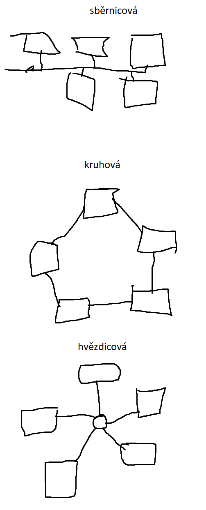

# 16. Topologie poč. sítí

> Druhy sítí \
> Prvky sítě

## Druhy sítí

- sběrnicová
  - všechny počítače napojeny na jednu sběrnici
  - jednoduchý, málo kabelů
  - nemožné vysílání více klientů (kolize)
  - jeden bod selhání, omezená délka kabelu
- kruhová
  - všechny počítače jsou propojené do kruhu
  - rozšiřitelnost, bez kolizí
  - jeden bod selhání (přerušení kruhu), data musí projít přes ostatní počítače
- hvězdicová
  - počítače napojené na ústřední router
  - mnoho bodů selhání (pouze router), lepší paralelizace
  - stromy – spojení více hvězd routery (do větší hvězdy)

## Prvky sítě

- repeater
  - zesiluje signál
- switch
  - spojuje zařízení v rámci jedné sítě
  - poměrně jednoduchý
- router
  - propojuje více sítí, dělá podsítě
  - připojení k vnější síti (internetu)
  - WI-FI
- bridge
  - propojení více místních sítí
- firewall
  - zařízení/systém (může být obojí) na ochranu sítě
  - prochází jím veškerá komunikane
  - blokace nechtěných/škodlivých packetů
  - blokace portů (port = identifikátor pro různé služby; email=25)
- gateway
  - propojení sítí s odlišnými protokoly
  - často router
- dráty
  - kroucená dvojlinka – málo rušení
  - optický kabel

