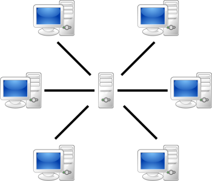
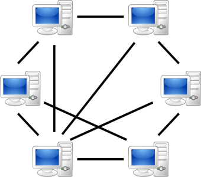

# 18. Klient-server

> Ostatní modely \
> Služby serveru

## Klient-server

### Definice

- Model propojení počítačů, síťová architektura, která odděluje klienta a server
- Síť centralizována okolo serveru, prostřednictví něj probíhá veškerá komunikace
- Klient a server mohou být uvnitř stejného počítače, nebo propojeni přes počítačovou síť (internet)

### Klient

- Koncový počítač, uživatel
- Aktivní - Iniciuje komunikaci se serverem
- Neřeší, jak server "vymyslí" odpověď, jenom že odpověd přijde
- Příjemné uživatelské rozhraní - GUI, webové stránky...

### Server

- Dodává klientovi nějakou službu (email, webovou stránku, předpověď pačasí...)
- Obsluhuje více klientů
- Pasivní - Čeká na požadacek od klienta
- Není uživatelský příjemný, koncový uživatek s ním přímo neinteraguje - Většinou nemá grafické prostředí - pouze terminál, dopovědi v JSON...

### Služby serveru

- Server často poskytuje API (Application Platform Interface)
  - "Knihovna", kterou může program využít pro interakci se serverem
  - Např. server předpovídající počasí může mít API, které umožní programu zeptat se, jestli bude zítra pršet
- Server často kombinuje více z následujících možností

#### DNS server

- Překládá jména domén na IP adresy
- Projekt Pi-hole - Blokuje domény reklamních serverů, funguje jako celosíťový adblock

#### DHCP server

- Přiřazuje IP adresy k nově připojeným zařízením

#### Webový server

- Poskytuje klientům (webovým prohlížecům) webové stránky (html, text, obrázky, další soubory)
- Komunikuje protokolem HTTPS (případně nezabezpečeným HTTP)
- Může být veřejný, nebo na intranetu

#### Emailový server

- Elektronický komunikační systém
- Využívá protokol SMTP

#### Souborový server

- Sdílí s počítači na síti soubory, databáze
- Umožňují přístup k datům z více míst, centrální zálohování dat, sdílení dat...
- Využívají protokol FTP, případně také HTTPS (webový server lze považovat za souborový server)
- Např. ve škole, kancelářích pro sdílení uživatelských soborů napříč počítači
- Cloudové řešení jako Onedrive (Microsoft), Google drive

#### Tiskový server

- Spravuje připojené tiskárny, dělí mezi ně úkoly

#### Git server

- Spravování verzí a úprav většinou zdrojového kódu
- Cloudový povidečí jako Github (Microsoft), Gitlab

#### Herní server

- Např. minecraftový server, servery CSka...

#### Cloud

- Možnost snadno si pronajmou servery (virtuální počítače) a úložní místo
- Poskytovatelé AWS (Amazon), Micorosft Azure, Google...

## Peer-to-peer

### Definice

- Oproti modelu klient-server neexistuje centrální prvek - server
- Klienti komunikují přímo mezi sebou, model klient-klient
- V praxi se často používají proxy servery - "Seznamují" mezi sebou klienty

### Výhody a nevýhody

- Decentralizované - Výpadkem serveru není celá síť ochromena
- S rostoucím množstvím klientů se síť nezpomaluje (server se nepřehlcuje), ale neopak se zrychluje
- Neexistuje centrální autorita (server), která by mohla "zabanovat" klienty, které se např. snaží šířit viry, nebo spamovat
- Zárověn však žádná centrální autorita (server) nemůže síť cenzurovat

### Využití

#### Sdílení souborů

- Protokoly jako Bittorent
- Špatná pověst kvůli popularitě mezi piráty (nelze zakázat), ale využívána i k legitimním účelům (např. distribuce linuxu - není nutné pronajímat server)

#### Matrix chat

- Anonymní decentralizovaný způsob posílání zpráv

#### Tor

- Anonymní způsob využívání internetu
- Něco na způsob peer-to-peer sítě
