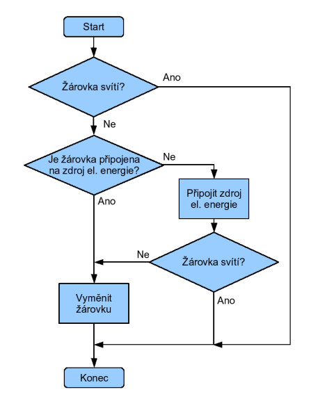
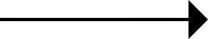
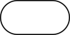
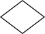
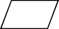

# 8. Algoritmy

> Vývojové diagramy \
> Základní stavební bloky algoritmů

## Algoritmus

### Definice

- Algoritmus je přesný návod/postup kterým lze vyřešit úlohu
- Umožnuje řešit úlohu, aniž by jí řešitel rozuměl
- Příklady
  - Vzoreček s diskriminantem pro řešení kvadratické rovnice
  - Gaussova eliminační metoda
  - Recept na knedlovepřo
  - ...

### Základní stavební bloky algoritmů

#### Podminky

- `IF`
  - Pokud je výrok pravda spustí se instrukce v podmínce pokud ne, algoritmus se posune na dalsi krok
  - Vyžaduje logickou spojku
    - `==` - Rovnost
    - `&&` - A zároveň
    - `||` - Nebo
    - `!` - Negace
    - ...
- `ELSE`
  - Program se spustí pouze pokud podmínka v příslušnám `IF` není splněna
- `ELSE IF`
  - Kombinace obou předchozích
- `MATCH`
  - Něco jako `IF`
  - Porovnává vstupní hodnotu se vzorcem

#### Skok

- `GOTO`
  - Skočí na jiné místo v pragramu
  - Dnes se moc nepoužívá - nepřehledné - neomezené

#### Cyklus

- `LOOP` (`WHILE TRUE`)
  - Nekonečný cyklus
- `WHILE`
  - Tělo cyklu se opakuje dokud je stanovená podmínka pravdidá
- `FOR`
  - Tělo cyklu má předvídatelný počet iterací
    - Např. pro každý prvek iterátoru (např. pole)

#### Funkce

- Něco jako matematická funkce, ale může ovlivnit/být ovlivněna nejen argumentem (např. globálními proměnými)
- Slouží k rozdělení algoritmu na měnší části
- Umožňuje rekurzi

### Vlastnosti algoritmu

- Elementárnost - Konečný počet instrukcí
- Konečnost - Musí skončit v konečném počtu kroků
- Obecnost - Neřeší konkrétní problém (3 + 7) ale třídu problémů (a + b)
- Determinovanost - Pro stejné vstupy poskytuje stejné výstupy
- Determinismus - Každý krok je jednoznačně a přesně definován
- Výstup - Má alespoň jeden výstup, který se vztahuje ke vstupu

## Vývojové diagramy (Flowcharty)

- Grafickému znázornění algoritmu nebo nějakého procesu
- Rozkreslují jednotlivé kroky algoritmu a jejich vzájemné vztahy
- Dataflow chart - Znázorňuje tok dat

### Symboly

#### Šipka

- Spojuje ostatní symboly
- Určuje směr postupu při vykonávání kroků

#### Oblý obdelník

- Označuje začátek nebo konec diagramu

#### Obdelník

- Označuje dílčí krok

#### Pootočený kosočtverec

- Označuje podmíněnou operaci
- V tommto bodě se postup na základě podmínky větví

#### Kosodelník

- Označuje vstup nebo výstup

