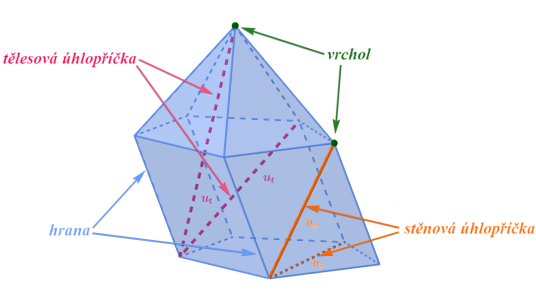
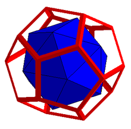
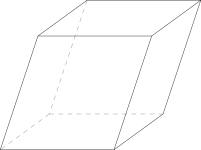
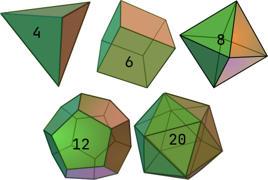
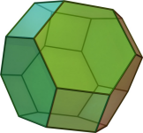

# 11. Mnohostěny

> Charakterizovat jednotlivé mnohostěny do kategorií dle jejich společných vlastností. \
> Odvodit vztahy pro výpočty objemů a obsahu povrchů. \
> Řešit polohové vlastnosti útvarů v prostoru a určit jejich společné množiny bodů, vzdálenosti či odchylky.

## Definice

- Mnohostěn = polyedr
- Troj (případně více) rozměrné těleso
- Povrch se skládá z konečně mnoha mnohoúhelníkových stěn
- Nazývají se podle počtu stěn: čtyřstěn (tetraedr), pětistěn (pentaedr), ...

### Pojmy

- Hrana - Úsečka, ve které se potkávají 2 stěny
- Vrchol - Bod, ve kterém se potkávají alespoň 3 hrany
- Úhlopříčka - Úsečka, která propojuje 2 vrcholy

#### Duální mnohostěn

- Ke každému mnohostěnu existuje duální mnohostěn
- Duální mnohostěn má vrcholy ve "středech" stěn původního mnohostěnu

### Konvexní mnohostěn

- $t$ - Konvexní těleso
- Úsečka mezi každými 2 body konvexního tělesa $t$ je celá obsažena v tělesu $t$
  - $\forall (A, \ B \in t); \ \overline{AB} \in t$
- $\iff$ Úsečka mezi každými 2 vrchlovy tělesa $t$ je celá obsažena v tělesu $t$
- $\iff$ $t$ je průnikem konečně mnoha poloprostorů

#### Eulerova věta

- Vztah mezi počtem vrcholů $V$, hran $H$ a stěn $S$ kovexního mnohostěnu
- $V - H + S = 2$

### Obsah povrchu mnohostěnu

- Součet obsahů stěn
  - Pro krychly o hraně délky $a$ - $S =  6 \cdot a$
  - Pro hranol o hranách délky $a, \ b, \ c$ - $S = 2(a + b + c)$
  - ...

### Objem mnohostěnu

- Pro jednoduché mnohostěny elegantní vzorečky
- Objem složitějších mnohostěnů lze počítat např. rozdělení na hranoly a jehlany
- Obecný vzoreček $V = \frac{1}{3}|\sum\limits_{F} (Q_F \cdot N_F) S_F|$
  - $\sum\limits_{F}$ - Summa přes stěny $F$ mnohostěnu
  - $Q_F$ - Libovolný bod stěny $F$
  - $N_F$ - Jednotkový vektor kolmý na $F$ směřující mimo mnohostěn
  - $\cdot$ - Skalární součin
  - $S_F$ - Obsah stěny $F$

## Význačné mnohostěny

### Jehlan

- Tvořený podstavou, hlavním vrcholem a trojúhelníkovými stěnami, sdílející hranu s podstavou a bod s hlavním vrcholem
- Jmenují se podle počtu trojúhelníkových stěn - trojboký, čtyřboký, ...
- Objem - $V = \frac{1}{3} S_p \cdot v$
  - $S_p$ - Obsah podstavy
  - $v$ - Výška
- Obsah - $S = S_p + S_q$
  - $S_p$ - Obsah podstavy
  - $S_q$ - Obsah pláště

### Hranol

- Mnohostěny tvořené dvěma shodnými, stejně orientovanými a v různých vzájemně rovnoběžných rovinách ležícími mnohoúhelníkovými stěnami (podstavami) a rovnoběžníkovými stěnami, sdílecící hranu s podstavou
- Objem: $V = S_p \cdot v$
  - $S_p$ - Obsah podstavy
  - $v$ - Výška
- Obsah - $S = 2 \cdot S_p + S_q$
  - $S_p$ - Obsah podstavy
  - $S_q$ - Obsah pláště
- Krychle - Speciální případ hranolu, který má všechny hrany stejně dlouhé

### Rovnoběžnostěn

- Čtyřboký hranol, jehož podstavou je rovnoběžník - Protilehlé stěny jsou rovnoběžné
- Hranoly jsou speciální případy rovnoběžnostěnu

### Pravidelné mnohostěny

- Stěny jsou shodné pravidelné mnohoúhelníky $\implies$ Z každého vrcholu vychází stejný počet hran, každá stěna je ohraničena stejným počtem hran

#### Platónská tělesa

- Konvexní pravidelné mnohostěny
  - Čtyřstěn - Stěny jsou trojůhelníky
  - Šestistěn (krychle) - Stěny jsou čtverce
  - Osmistěn - Stěny jsou trojůhelníky
  - Dvanáctistěn - Stěny jsou pětiúhelníky
  - Dvacetistěn - Stěny jsou trojúhelníky

#### Klepler-Poinsotova tělesa

- Nekonvexní pravidelné mnohostěny, část plochy stěn je zanořena do objemu tělesa (jinak by nebyly všechny stěny shodné)
  - Malý hvězdicovitý dvanáctistěn - Stěny jsou pentagramy
  - Velký hvězdicovitý dvanáctistěn - Stěny jsou pentagramy
  - Velký dvacetistěn - Stěny jsou trojúhelníky
  - Velký dvanáctistěn - Stěny jsou pětiúhelníky

### Archimédovská tělesa

- Vysoce symetrický, polopravidelný konvexní mnohostěn
- Ze 2, nebo více typů pravidelných mnohoúhelníků
- Např. komolý osmistěn

