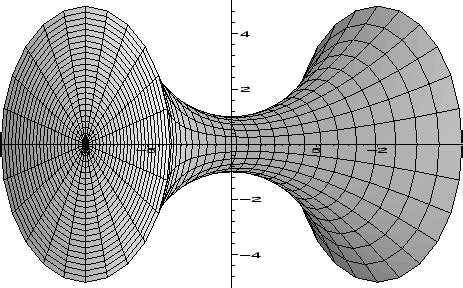
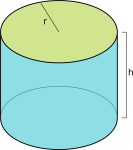
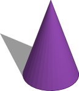
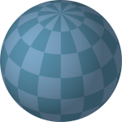
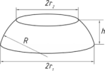
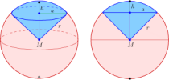
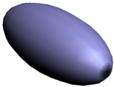
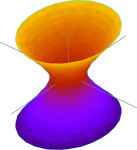
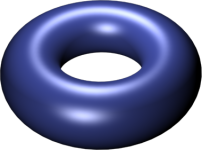
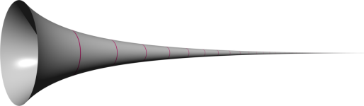

# 12. Rotační tělesa

> Charakterizovat jednotlivá tělesa s využitím pojmů rotace a osa souměrnosti. \
> Odvodit vztahy a vypočítat jejich objemy a povrchy. \
> Rozlišit části koule a kulové plochy.

## Definice

- Trojrozměrné těleso vzniklé rotací rovinného útvaru (křivky) kolem přímky
- Narozdíl od (konvexních) mnohostěnů nejsou "hranatá", nejdou vyjádřit průnikem konečně mnoha poloprostorů

### Objem rotačního tělesa

- Pro jednoduchá rotační tělesa elegantní vzorečky
- Pokud je přímkou, okolo které rotujeme, osa $x$ a rotovanou křivku lze vyjádřit spojitou $f$ na intervalu $\langle a, \ b \rangle$ spojitou, můžeme využít integrální počet
  - Rotační těleso rozřežeme na limitně tenké komolé kužely (tedy válce), jejichž objemy posčítáme
  - $V = \pi \int^b_a f (x) ^2 \ dx$
  - [Odvvození](http://mdg.vsb.cz/portal/m2/kapitoly/kapitola_3_3.pdf)

### Povrch pláště rotačního tělesa

- Pro jednoduchá rotační tělesa elegantní vzorečky
- Pokud je přímkou, okolo které rotujeme, osa $x$ a rotovanou křivku lze vyjádřit funkcí $f$ na intervalu $\langle a, \ b \rangle$ spojitou, nezápornou a se spojitou derivací, můžeme využít integrální počet
  - Vyjdeme z [délky křivky pomocí integrálu](../24/_.md#d%C3%A9lka-k%C5%99ivky-pomoc%C3%AD-integr%C3%A1lu) - $L = \int^b_a \sqrt{1 + (f'(x))^2} \ dx$
  - Rotační těleso rozřežeme na limitně tenké komolé kužely, obsahy jejich plášťů posčítáme
  - $S_P = 2 \pi \int^b_a f(x) \sqrt{1 + (f'(x))^2} \ dx$
  - Plochu podstav tvoří kružnice o poloměru $f(a)$ a $f(b)$
  - [Odvození](http://mdg.vsb.cz/portal/m2/kapitoly/kapitola_3_4.pdf)

## Význačná rotační tělesa

- Existuje nekonečně mnoho nepodobných rotačních těles

### Rotační válec

#### Definice

- Vznikne rotací úsečky, která je rovnoběžná a nezdílí body s osou rotace, nebo obdelníku $\iff$ vznikne rotací konstantní funkce
- Vymezen dvěmi kruhovými podstavami a pláštěm, přímky pláště jsou rovnoběžné a nejsou rovnoběžné s podstavou

#### Vlastnosti

- Objem a povrch neovlivní, pokud je zkosený
- Objem - $V = S_p \cdot v = \pi r^2 \cdot v$
  - $S_p = \pi r^2$ - Obsah podstavy
  - $v$ - Výška, vzdálenost podstav
- Povrchu - $S = 2 S_p + S_q = 2 \pi r (r + v)$
  - $v$ - Výška, vzdálenost podstav
  - $r$ - Poloměr podstavy
  - $S_p = \pi r^2$ - Obsah podstavy
  - $S_q = 2 \pi r v$ - Obsah pláště

### Rotační kužel

#### Definice

- Vznikne rotací úsečky, která je různoběžná s osou rotace, nebo pravoúhlého trojúhelníku $\iff$ vznikne rotací lineární funkce
- Vymezen kruhovou podstavou, přímky pláště jsou různoběžné a sbíhají se v jednom bodě
- Kuželový prostor ohraničený rovinou
- Komolý kužel - Kužel s odříznutou špičkou (kuželem)

#### Vlastnosti

- Objem a povrch neovlivní, pokud je zkosený
- Objem - $V = \frac{1}{3} (S_p \cdot v) = \frac{1}{3}(\pi r^2 \cdot v$)
  - $S_p = \pi r^2$ - Obsah podstavy
  - $v$ - Výška, vzdálenost podstavy od vrcholu
- Povrchu - $S = S_p + S_q =  \pi r (r + \sqrt{v^2 + r^2})$
  - $v$ - Výška, vzdálenost podstavy od vrcholu
  - $r$ - Poloměr podstavy
  - $S_p = \pi r^2$ - Obsah podstavy
  - $S_q = \pi r \sqrt{v^2 + r^2}$ - Obsah pláště

### Koule

- Vznikne rotací kružnice okolo svého poloměru
- Množina všech bodů prostoru s konstaní vzdáleností od středu
- Sféra (kulová plocha) - Povrch koule

#### Vlastnosti

- Průmětem je kruh
- Objem - $V = \frac{4}{3} \pi r^3$
  - $r$ - Poloměr koule
  - Lze snadno odvodit integrálem
- Povrchu - $S = 4 \pi r^2$
  - $r$ - Poloměr koule

#### Kulový vrchlík

- Část sféry určená řezem rovinou
- Speciální případ polokoule - Část koule určená řezem rovinou, která prochází středem

#### Kulová vrstva

- Část koule určená řezem dvojcí rovnoběžných rovin

#### Kulová výseč

- Průnik koule a prostorového úhlu

### Elipsoid

- Vznikne rotací elipsy

### Hyperboloid

- Vznikne rotací hyperboly
- Hyperbolická lobačovského geometrie

### Paraboloid

- Vznikne rotací paraboly
- Využívají parabolické antény (všechny signály odráží do 1 bodu)

### Torus (Anuloid)

- "Donut"
- Vznikne rotací kružnice

### Gabrielův roh

- Těleso, které má nekonečných povrch, ale konečný objem
- Vznikne rotací funkce $y = \frac{1}{x} \land x \ge 1$ (ramene hyperboly) kolem osy $x$

