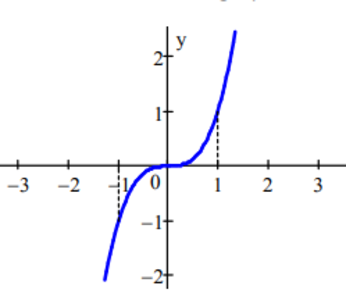
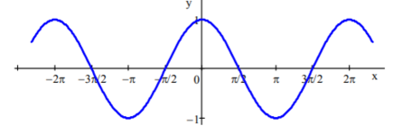
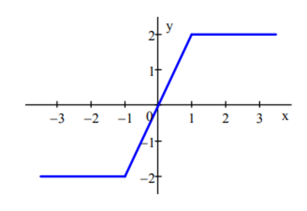
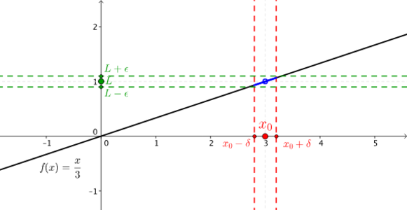
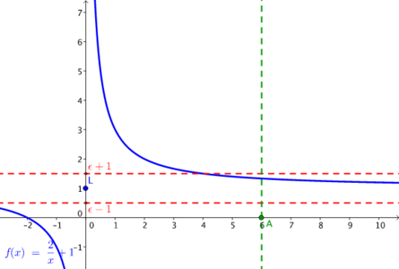
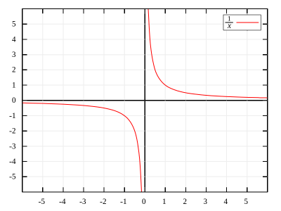

# 22. Limita funkce

> Definovat pojem funkce a vlastnosti funkcí. Rozlišit typy elementárních funkcí. \
> Vysvětlit pojmy spojitost funkce v bodě a na intervalu. \
> Rozlišit a určit limitu funkce v bodě a v nevlastním bodě. \
> Užít limity funkce k určení asymptoty grafu funkce a tečny ke grafu funkce.

## Funkce

### Definice

- Funkce je zobrazením z oboru definičního oboru (množiny) funkce do jejího oboru hodnot (množiny)
- Každému prvku z definičního oboru přiřazuje právě jeden prvek z oboru hodnot

### Vlastosti funkcí

#### Sudost

- Osově souměrná podle osy $y$
- $\forall x \in D(f): f(x) = f(-x)$

#### Lichost

- Bodově souměrná podle bodu $[0,0]$
- $\forall x \in D(f): f(-x) = -f(x)$

#### Periodicita

- Funkce se po nějaké periodě opakuje
- $\exists p \in R^+, \ \forall x: \ f(x) = f(x + p)$

#### Monotónnost

- Ryze monotonní
  - Rostoucí
    - Funkční hodnota roste s $x$
    - $\forall x_1 < x_2 : f(x_1) < f(x_2)$
  - Klesající
    - Funkční hodnota klesá s $x$
    - $\forall x_1 > x_2: f(x_1) > f(x_2)$

- Monotónní
  - Neklesající
    - Funkční hodnota roste nebo je konstantní s $x$
    - $\forall x_1 > x_2: f(x_1) \ge f(x_2)$
  - Nerostoucí
    - Funkční hodnota klesá nebo je konstantní s $x$
    - $\forall x_1 < x_2 : f(x_1) \le f(x_2)$

#### Prostost

- Pro každé $y$ existuje právě jedno $x$
- $\forall x_1 \not = x_2: f(x_1) \not = f(x_2)$

#### Omezenost

- Omezenost zhora
  - $\exists a \in D(f): \forall x, f(x) < f(a)$
  - $a$ je (globální) maximum funkce
- Omezenost zdola
  - $\exists a \in D(f): \forall x, f(x) > f(a)$
  - $a$ je (globální) minimum funkce
- Funkce je omezená $\iff$ je omezená zhora i zdola

### Elementární funkce

- Elementánrí funkce jsou funkce, které lze získat konečným počtem sečtení, odečtení, násobení, dělení a složení "základních" funkcí
- "Základní" funkce
  - Konstantní funkce
  - Lineární funkce
  - Mocninné funkce (s racionálním exponentem)
  - Exponenciální, logaritmické funkce
  - Trigonometrické, cyklometrické funkce
  - (Hyperbolické, hyperbolometrické funkce)

## Limita

### Pojmy

- Epsilon okolí bodu
  - Pro $r \in R;$ $\epsilon > 0$ je otevřený interval $(r-\epsilon, \ r+\epsilon)$ epsilon okolí bodu $r$
  - Značí se $U(a,\epsilon)$
  - Příklad: $U(5, 2)$

- Redukované (prstencové) epsilon okolí bodu
  - Pro $r \in R;\space \epsilon > 0$ je $(r-\epsilon,r) \cup (r,r+\epsilon)$
  - Značí se $R(a, \epsilon)$
- Hromadný bod množiny
  - Prvek $a \in R$ je hromadným bodem množiny $M \subseteq R$ pokud platí, že v každém jeho redukovaném okolí, jakkoliv malém, leží nějaký bod množiny $M$
  - $a \in R; \ M \subseteq R$
  - $\forall \epsilon > 0 : R(a, \epsilon) \cap M \not = \emptyset $

### Definice limity ve vlastním bodě

- $f - \text{funkce}$
- $x_0 - \text{Hromadný bod} \ D(f)$
- $x_0 \in R$ je hromadný bod definičního oboru funkce $f$
- $L \in R$ je limitou funkce $f$ v bodě $x_0$ $\iff$
- $\lim\limits_{a \to x_0}f(a) = L \iff \\ (\forall \epsilon > 0), \ (\exists \delta > 0), \ (\forall x; \ x \in D(f) \land x \in R(x_0,\delta)), \ (0 < |x - x_0| < \delta \implies |f(x) - L| < \epsilon)$
- $\lim\limits_{a \to x_0}f(a) = L \iff \\ \forall \epsilon > 0; \ \exists \delta > 0; \ (\forall x; \ x \in D(f) \land x \in R(x_0, \ \delta))\implies f(x) \in U(L, \epsilon)$

### Definice limity v nevlastním bodě

- Hledáme limitu funkce, když se blížíme k nekonečnu
- $\infty$ - Hromadný bod funkce $f$
- Pro $+\infty$
  - $\lim\limits_{x \to \infty} f(x) = L \iff$
  - $\forall \epsilon \in R^+; \ \exists A \in R; \ (\forall x; x \in D(f) \land x > A) : |f(x) - L| < \epsilon $
- Pro $-\infty$
  - $\lim\limits_{x \to -\infty} f(x) = L \iff$
  - $\forall \epsilon \in R^+; \ \exists A \in R; \ (\forall x; x \in D(f) \land x < A) : |f(x) - L| < \epsilon$

### Spojitost funkce

- Funkce $f$ je spojitá, když “se její hodnoty mění plynule, lze nakreslit jedním tahem”
- Funkce $f$ je spojitá v bodě $x$ $\iff$ $\lim\limits_{a \to x} f(a)=f(x)$
- Funkce $f$ je spojitá na interval $\iff$ je spojitá na všech bodech intervalu

### Asymptota

- Přímka, jejíž vzdálenost k funkci se limitně blíží k nule, když se jedna, nebo obě souřadnice blíží k nekonečnu
- Asymptota bez směrnice
  - Kolmá na osu x
  - V "jednobodové díře" v definičním oboru, pokud zde existuje alespoň jedna jednostranná limita
- Asymptota se směrnicí
  - $f$ - Funkce
  - $p: y = ax + b$ - Rovnice asymptoty
    - $a = \lim\limits_{x \to \pm \infty} \frac{f(x)}{x}$
    - $b = \lim\limits_{x \to \pm \infty} f(x) -ax$

### Tečna

- Tečna je přímka, která má v bodě dotyku stejný směrový vektor jako křivka, ke které je tečnou
- Rovnice tečny
  - V bodě $A = [a; \ f(a)]$ má funkce $f$ tečnu $t$
  - $t: y = f'(a) \cdot (x - a) + f(a)$

## Vzorečky

### Vlastnosti limit

- $\lim\limits_{x \to a} f(x) = A; \ \lim_{x \to a} g(x) = B$
- $\lim\limits_{x \to a}[f(x)+g(x)] = \lim_{x \to a}f(x) + \lim_{x \to a}g(x)=A+B$
- $\lim\limits_{x \to a}[f(x)\cdot g(x)]=\lim_{x \to a}f(x) \cdot \lim_{x \to a} g(x)=A\cdot B$
- $\lim\limits_{x \to a}[\frac{f(x)}{g(x)}]= \frac{\lim_{x \to a} f(x)}{\lim_{x \to a}g(x)} =\frac{A}{B}$
- $\lim\limits_{x \to a}c \cdot f(x)=c \cdot A$

### L'Hospitalovo pravidlo

- Lze někdy použít pro výpočet limit ve tvaru podílu
- $f, \ g - \text{funkce}$
- $f(x_0) = g(x_0) = 0 \implies \lim\limits_{x \to x_0} \frac{f(x)}{g(x)} = \lim\limits_{x \to x_0} \frac{f'(x)}{g'(x)}$
- Pokud $\lim\limits_{x \to x_0} \frac{f'(x)}{g'(x)}$ neexistuje, neznamená to nutně, že neexistuje ani $\lim\limits_{x \to x_0} \frac{f(x)}{g(x)}$
