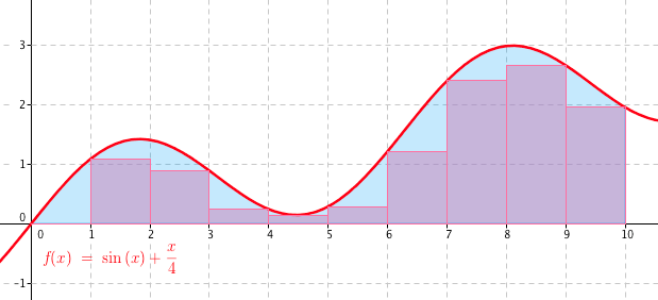
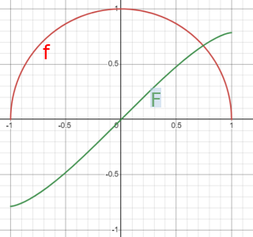
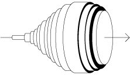

# 24. Integrální počet

> Definovat pojem primitivní funkce. Vysvětlit význam integrační konstanty. \
> Charakterizovat a užít metody určování primitivních funkcí včetně metody per partes a substituce. \
> Definovat určitý integrál a popsat a užít jeho výpočet. \
> Aplikovat poznatky o integrálech na výpočet obsahu rovinných útvarů a objemu rotačních těles.

## Integrace

- Hledání původní funkce z její deriave
- Výpočet polchy pod grafem funkce

## Primitivní funkce

- Primitivní funkce $F$ je taková funkce k funkci $f$, že její derivace je rovna původní funkci
- Pro každou funkci existuje nekonečně mnoho primitivních funkcí, protože derivace z konstanty je 0, nebo žádná primitivní funkce neexistuje
- $F(x) = \int f(x) \ dx + c$
  - $F$ - Primitivní funkce k $f$
  - $f$ - Funkce, "integrand"
  - $dx$ - Proměnná, vůči které integrujeme
  - $c$ - Integrančí konstanta (derivace z konstanty je $0$ $\implies$ může být libovolná
  - $\forall x \in D(f): F'(x) = f(x)$

### Výpočetní metody

#### Tabulková hodnota (viz [vzorečky](#vzorečky))

#### Vytknutí konstanty

- $\int k \cdot f(x) \ dx = k \int f(x) \ dx$

#### Integrace per partes (po částech)

- Hledání primitivní funkce k funci v součinovém tvaru
- $\int u \cdot v' = u \cdot v - \int u' \cdot v$
- Důkaz
  - $u, v$ - Derivovatelné funkce
  - $(u \cdot v)' = u' \cdot v + u \cdot v'$
  - $\int (u \cdot v)' = \int u' \cdot v + \int u \cdot v'$
  - $u \cdot v = \int u' \cdot v + \int u \cdot v'$
  - $\int u \cdot v' = u \cdot v - \int u' \cdot v$

#### Substituční metoda

- Metoda integrování pomocí nové proměné
- $\int f(g(x)) \cdot g' (x) \ dx = F(g(x)) + c$
- Důkaz
  - $f$ - Funkce
  - $g$ - Derivovatelná funkce
  - $F$ - Primitivní funkce k $f$
  - $\int f(g(x)) \cdot g' (x) \ dx = \int f(t) \cdot t'(x) \ dt$
    - Substituce $t = g(x)$, změna integrační proměnné z $dx$ na $dt$
    - $t' = 1$ (derivujeme podle $t$)
  - $\int f(t) \ dt = F(t) + c$
  - $\int f(t) \ dt = F(g(x)) + c$
  - $\int f(g(x)) \cdot g'(x) \ dx = F(g(x)) + c$

#### [Integrace racionálních funkcí](https://math.fel.cvut.cz/mt/txtd/3/txc3db3d.htm)

## Určitý integrál

- Měří velikost plochy obrazců popsaných funkcí
- $\int^b_a f(x) \ dx = A$ - Plocha pod grafem funkce $f$ od $x = a$ do $x = b$ je $A$

- Newton-Leibnizova formule
  - $f$ - funkce spojitá na intervalu $\langle a, \ b \rangle$
  - $F$ - Primitivní funkce k $f$ na intervalu $\langle a, \ b \rangle$
  - $\int^b_a f(x)\ dx = [F(x)]^b_a = F(b) - F(a)$
- Riemannův integrál, Lebesgueův integrál
  - Obecnější definice
  - Lze zintegrovat více funkcí

## Délka křivky pomocí integrálu

- $f$ - Derivovatelná funkce se spojitou derivací
- $\langle a, \ b \rangle$ - Interval, na kterém hledáme délku funkce (křivky)
- $L = \int^b_a \sqrt{(1 + (f'(x))^2)} \ dx$
- [Odvození](https://socratic.org/questions/how-do-you-find-the-length-of-a-curve-in-calculus)

## Obsahy rovinných útvarů

- $S$ - Obsah útvaru určený grafem spojitých funkcí $f(x)$ a $g(x)$
- Pokud má rovnice $f(x) = g(x)$ 2 řešení $(a,b)$, stávají se mezemi integrálu
- $S = \int^b_a f(x) \ dx - \int^b_a g(x) \ dx = F(b) - F(a) - G(b) + G(a)$

#### Kružnice

- Kružnice (s poloměrem 1) jako rovnice $x^2 + y^2 = 1$
- $\implies$ půlkružnice jako funkce $y = \sqrt{1 - x^2}$
- $\implies$ obsah pod půlkružnicí je integrálem funkce $y = \sqrt{1 - x^2}$
  - $\int \sqrt{1 - x^2} \ dx = \frac 1 2  (\sqrt{1 - x^2} \cdot x + \sin^{-1}(x))$
- $\implies$ Obsah kruhu je $2 \cdot [\frac 1 2  (\sqrt{1 - x^2} \cdot x + \sin^{-1}(x))]^1_{-1} = \pi$

## Objem rotačních těles

- Rotační těleso vzniklé vzniklé rotací (křivky) funkce $f$ kolem osy $x$ na intervalu $\langle a, \ b \rangle$
- Rotační těleso se rozřeže na kružnice, jejichž "obsahy se posčítají"
  - $V = \pi \int^b_a f (x) ^2 \ dx$

## Vzorečky

#### Vlastnosti integrálů

- $\int f(x) + g(x) \ dx = \int f(x) \ dx + \int g(x) \ dx$
- $\int k \cdot f(x) \ dx = k \int f(x) \ dx$
- $\int f(x)' \ dx = f(x) + c$
- $\int u' \cdot v = u \cdot v - \int u \cdot v'$
- $\int f(g(x))\cdot g' (x) \ dx = F(g(x)) + c$

#### Integrály základních funkcí

- $\int 0 \ dx = c$
- $\int a \ dx = a \cdot x + c$
- $\int x^n \ dx = \frac{1}{n+1} x^{n+1} + c; n \not = 1$
- $\int \frac{1}{x} \ dx = \ln{|x|} + c$
- $\int a^x \ dx = \frac{a^x}{\ln{(a)}} + c; \ a > 0 \land a \not = 1$
- $\int \sin \ x \ dx = -\cos{x} +c$
- $\int \cos{x} \ dx = \sin{x} +c$

#### Neurčitý integrál

- $\int^b_a f(x)\ dx = [F(x)]^b_a = F(b) - F(a)$
