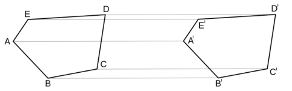
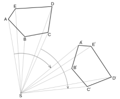
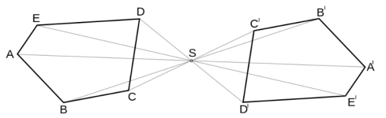
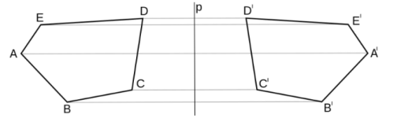
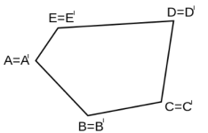
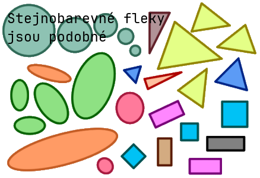

# 5. Shodná a Podobná zobrazení

> Definovat pojem shodného/podobného zobrazení v rovině. Základní rozdělení těchto zobrazení. \
> Matematická tvrzení využívající shodnosti/podobnosti (věty o shodnosti a podobnosti trojúhelníků, Euklidovy věty, odvození goniometrických vztahů v pravoúhlém trojúhelníku). \
> Využití shodnosti/podobnosti k řešení úloh.

## Zobrazení

- Geometrické zobrazení přiřadí každému bodu $A$ z tělesa $U$ právě jeden bod $A'$ z tělesa $U'$

### Shodné

- Zobrazení mezi Euklidovskými prostory, které zachovává vzdálenosti

#### Posunutí (translace)

#### Otočení (rotace)

#### Středová souměrnost (symetrie)

#### Osová souměrnost (symetrie)

#### Totožnost (identita)

#### Jejich složení

### Podobné

- Zobrazení Euklidovských prostorů, vzdálenosti jsou přenásobeny koeficientem (měřítkem podobnosti)
- Odpovídající hrany podobných mnohoúhelníků jsou ve vzájemném poměru a odpovídající úhly si jsou rovny
- Všechny kružnice, čtverce a rovnostranné trojúhelníky si jsou podobné

#### podobné trojúhelníky

- $\triangle ABC \sim \triangle DEF$ pokud vyhovují jedné z následujících vět
- věta sss
  - $\frac{|AB|}{|DE|} = \frac{|BC|}{|EF|} = \frac{|AC|}{|DF|}$
  - mají sobě rovné poměry všech tři stran
- věta sus
  - mají sobě rovné poměry délek dvou odpovídajících stran a shodují se v úhlu jimi sevřeném, jsou si podobné.
- věta uu -$\angle BAC = \angle EDF \land \angle ABC = \angle DEF$
- věta ssu
