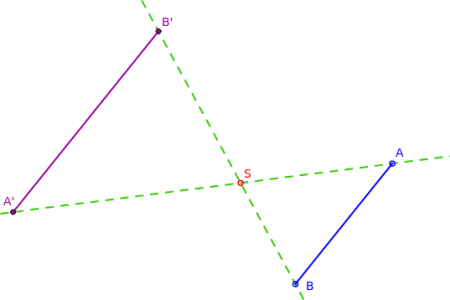
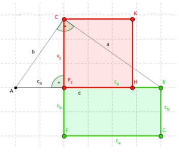
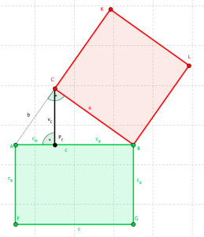

# 5. Shodná a podobná zobrazení

> Definovat pojem shodného/podobného zobrazení v rovině. Základní rozdělení těchto zobrazení. \
> Matematická tvrzení využívající shodnosti/podobnosti (věty o shodnosti a podobnosti trojúhelníků, Euklidovy věty, odvození goniometrických vztahů v pravoúhlém trojúhelníku). \
> Využití shodnosti/podobnosti k řešení úloh.

## Zobrazení

- Geometrické zobrazení přiřadí každému bodu $A$ z tělesa $U$ právě jeden bod $A'$ z tělesa $U'$

### Shodné zobrazení (shodnost)

- Zobrazení v rovině je shodné $\iff$ pro každé dva body $X, \ Y$ roviny a jejich obrazy $X', \ Y'$ platí $|XY| = |X'Y'|$
- Zachovává vzdálenosti
- Vždy prosté

#### Posunutí (translace)

#### Otočení (rotace)

#### Středová souměrnost (symetrie)

#### Osová souměrnost (symetrie)

#### Totožnost (identita)

#### Jejich složení

### Podobné zobrazení (podobnost)

- Zobrazení v rovině je shodné $\iff$ pro každé dva body $X, \ Y$ roviny a jejich obrazy $X', \ Y'$ paltí $|XY| = k \cdot |X'Y'|$
  - $k \in R^+$ - Koeficient podobnosti
- Když $k = 1$ - Shodné zobrazení
- Zachovává poměry vzdáleností, úhly
- Vždy prosté
- Např. všechny kružnice, čtverce a rovnostranné trojúhelníky si jsou podobné

#### Stejnolehlost (homotetie)

- Zobrazí každý bod roviny $X$ na bod $X'$ takový, že $|X'S| = |\kappa| \cdot |XS|$
  - $S$ - Střed stejnolehlosti
  - $\kappa \in R \setminus{\set{0}}$ - Koeficient stejnolehlosti
- Pro $\kappa > 0$ leží bod $X'$ na polopřímce $SX$
- Pro $\kappa < 0$ leží bod $X'$ polopřímce opačné k polopřímce $SX$

## Využítí shodnosti a podobnosti

### Věty o shodnosti trojúhelníků

- Věta "SSS" - Shodují-li se dva trojúhelníky ve všech třech odpovídajících si stranách, pak jsou shodné
- Věta "SUS" - Shodují-li se dva trojúhelníky ve dvou stranách a úhlu jimi sevřeném, jsou shodné
- Věta "USU" - Shodují-li se dva trojúhelníky v jedné straně a v obou úhlech k ní přilehlých, jsou shodné
- Věta "SSU" - Shodují-li se dva trojúhelníky ve dvou stranách a úhlu proti delší z nich, jsou shodné

### Věty o podobnosti trojúhelníků

- Věta "SSS" - Mají-li dva trojúhelníky sobě rovné poměry všech tři stran, jsou podobné
- Věta "SUS" - Mají-li dva trojúhelníky sobě rovné poměry délek dvou odpovídajících stran a shodují se v úhlu jimi sevřeném, jsou podobné
- Věta "UU" - Mají-li dva trojúhelníky sobě rovné dvě dvojice úhlů, jsou podobné

### Euklidova věta o výšce

- Platí v pravoúhlém trojúhelníku
- $v^2_c = c_a \cdot c_b$
- Lze dokázat z podobnosti trojúhelníkú $A P_c C$ a $C P_c B$

### Euklidova věta o odvěsně

- Platí v pravoúhlém trojúhelníku
- $a^2 = c \cdot c_a \land b^2 = c \cdot c_b$
- Lze dokázat z podobnosti trojúhelníkú $A C B$ a $C P_c B$

### Goniometrické vzorce v pravoúhlém trojúhelníku

- Viz [10. Goniometrické funkce a rovnice](../10/_.md#p%C5%99es-pom%C4%9Bry-d%C3%A9lek-stran-v-pravo%C3%BAhl%C3%A9m-troj%C3%BAheln%C3%ADku)
