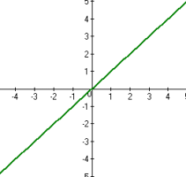
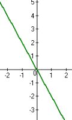
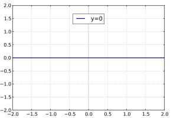
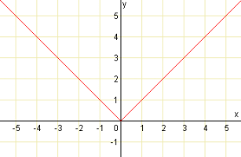

# 6. Lineární funkce a rovnice

> Definovat lineární funkci. \
> Zapsat předpis, zakreslit graf a popsat vlastnosti lineární funkce, funkce přímá úměrnost a lineární funkce s absolutní hodnotou. \
> Rozlišit a použít početní i grafická řešení lineárních rovnic, nerovnic a soustav dvou lineárních rovnic o dvou neznámých a zapsat množiny kořenů.

## Lineární funkce

### Definice

- "Lineární" = přímka
- Předpis $f(x): y = a x + b$
  - $a, \ b \in R \setminus \set {0}$

### Vlastnosti

- $D(f) = R; \ H(f) = R$
- Prostá, spojitá
- Nemá maximum, minimum
  - $\text{infimum}(f) = -\infty; \ \text{supremum}(f) = \infty$
- Derivace: $(ax + b)' = a$

#### Monotonie

- Když $a > 0$
  - Rostoucí

- Když $a < 0$
  - Klesající

### Speciální případy

#### Konstantní funkce

- Když $a = 0$
- Předpis $f(x): y = b$
  - $b \in R$
- $D(f) = R; \ H(f) = \set { b }$
- Není prostá, spojitá
- Sudá, když $b = 0$ také lichá
- $\text{maximum}(f) = \text{minimum}(f) = b$
- Periodická s "nekonečně malou periodou"

#### Přímá úměrnost

- Když $b = 0$
- Předpis $f(x): y = ax$
  - $a \in R \setminus \set { 0 }$
- $D(f) = R; \ H(f) = R$
- Prostá, spojitá
- Sudá
- Nemá maximum, minimum
  - $\text{infimum}(f) = -\infty; \ \text{supremum}(f) = \infty$
- Derivace: $(ax)' = a$

## Lineární funkce s absolutní hodnotou

### Definice

- Předpis $f(x): y = a |x| + b$
  - $a \in R \setminus \set {0}$
  - $b \in R$
- Absolutní hodnota vyjadřuje vzdálenost od počátku
  - $f(x) = x \iff x \ge 0$
  - $f(x) = -x \iff x < 0$

### Vlastnosti

- $D(f) = R; \ H(f) = \langle b, \infty)$
- Není prostá, spojitá, není derivovatelná
- Sudá
- Nemá maximum, má minimum
  - $\text{minimum}(f) = b; \ \text{supremum}(f) = \infty$

#### Monotonie

- Na celé definičním oboru není rostoucí, ani klesající
- Na intervalu $(-\infty, 0 \rangle$ klesající
- Na intervalu $\langle 0, \infty)$ roustoucí

## Lineární rovnice a soustavy rovnic

### Lineárních rovnic

- Řešením je realné číslo, všechna reálná čísla, nebo žádná neexistují

#### Metody řešení

- Algebraickými úpravami
- Grafické řešení
  - Lineární rovnice představuje přímku
  - Řešení rovnice představuje průsečík přímky s osou $x$
  - Existuje vždy jeden, nekonečně mnoho, nebo žádný průsečík

### Soustava lineárních rovnic

- Řešení soustavy o $n$ neznámých
  - Aby existovalo jednoznačné řešení je potřeba nejméně $n$ lineárně nezávislých rovnic
- Řešením je uspořádaná $n$-tice, nekonečně mnoho uspořádaných $n$-tic, nebo žádná neexistují

#### Metody řešení

- Algebraickými úpravami
  - Sčítání, odčítání rovnic
  - Vyjadřování si neznámých a dosazování do jiných rovnic
- Grafické řešení
  - Soustava dvou rovnic o dvou neznámých
    - Rovnice představují přímky
    - Řešení soustavy představuje průsečík přímek
    - Existuje vždy jeden, nekonečně mnoho, nebo žádný průsečík
  - Soustava třech rovnic o třech neznámých lze interpretovat jako hledání průsečíku třech rovin v prostoru
- Gaussova eliminační metoda
  - Přepis soustavy do matice
  - Upravování matice do shodového tvaru
- Cramerovo pravidlo
  - Přepis soutavy do matic
  - Využití determinantů matic k řešení
- Kvantový [algoritmus HHL](https://en.wikipedia.org/wiki/HHL_algorithm)
