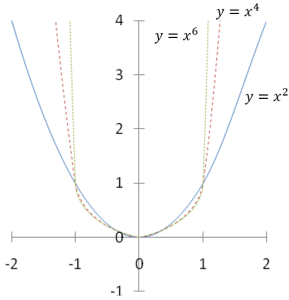
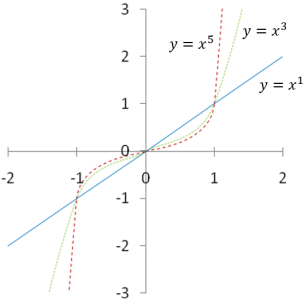
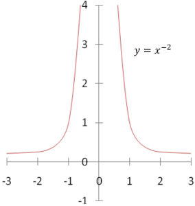
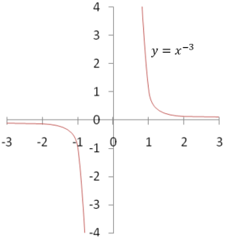
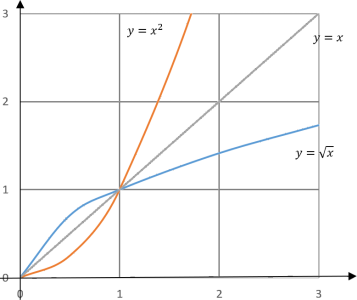

# 7. Mocninná funkce

> Definovat pojem mocninná funkce. Zapsat předpis, zakreslit graf a popsat vlastnosti mocninné funkce s celočíselným exponentem. \
> Rozlišit typy grafů pro určité skupiny exponentů. Charakterizovat vlastnosti funkce druhá odmocnina jako funkce inverzní. \
> Určit definiční obory a obory hodnot jednotlivých funkcí.

## Mocninná funkce

### Obecná definice

- Předpis $f(x) = a \cdot x^n + b$
  - $n \in R \setminus{\set{0, \pm 1}}$
  - $a \in R \setminus{\set{0}}$
  - $b \in R$

### Mocninná funkce s přirozeným exponentem

- Předpis $f(x): y = x^n$
  - $n \in N \setminus{\set{1}}$
- $D(f) = R$

#### Sudý exponent

- $H(f) = \langle 0, \ \infty)$
- spojitá, není prostá,
- Sudá
- Má minimum, nemá maximum
  - Minimum v $x = 0$
  - $\text{supremum}(f) = \infty$
- Rostoucí na intervalu $\langle 0, \ \infty)$, klesající na intervalu $\langle - \infty, 0 \rangle$

#### Lichý exponent

- $H(f) = R$
- Prostá, spojitá
- Lichá
- Nemá maximum, minimum
  - $\text{infimum}(f) = -\infty; \ \text{supremum}(f) = \infty$
- Rostoucí

### Mocninná funkce s záporným přirozeným exponentem

- Předpis $f(x): y = x^{-n} = \frac{1}{x^n}$
  - $n \in N \setminus{\set{1}}$
- $D(f) = R \setminus {\set {0}}$

#### Sudý záporný exponent

- Inverzní funkce k mocninné funkci
- $H(f) = (0, \ \infty)$
- Není prostá, není spojitá na všech $R$
- Sudá
- Nemá minimum, nemá maximum
  - $\text{infimum}(f) = 0; \ \text{supremum}(f) = \infty$
- Rostoucí na intervalu $\langle - \infty, 0)$, klesající na intervalu $(0, \ \infty)$

#### Lichý záporný exponent

- $H(f) = R \setminus {\set{0}}$
- Prostá, není spojitá na všech $R$
- Lichá
- Nemá maximum, minimum
  - $\text{infimum}(f) = -\infty; \ \text{supremum}(f) = \infty$
- Klesající na $\langle - \infty, 0) \cup   (0, \ \infty)$

### Odmocninná funkce

- Předpis $f(x): y = \sqrt[n]{x} = x^{\frac{1}{n}}$
  - $n \in N \setminus{\set{1}}$
- $D(f) = R_0^+$
  - Mocninné funkce sudého řádu nejsou prosté
  - $\implies$ neexistují pro ně inverzní funkce
  - $\implies$ definuje se "inverzní funkce" na polovině definičního oboru
- $H(f) = R_0^+$
- Prostá, spojitá
- Má minimum, nemá maximum
  - Minimum v $x = 0$
  - $\text{supremum}(f) = \infty$
- Rostoucí

