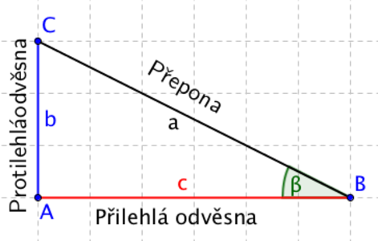
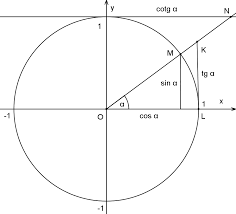
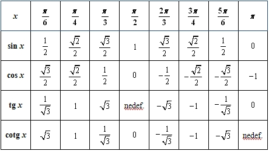
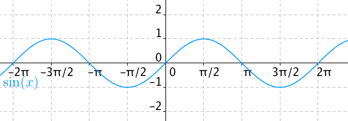
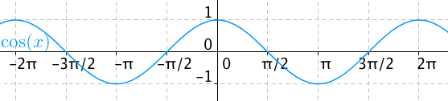
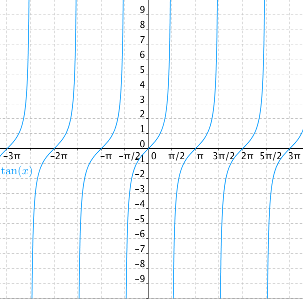

# 10. Goniometrické funkce a rovnice

> Užití obloukové míry a souvislost s velikostí úhlu ve stupních. \
> Zavedení poměrů stran pravoúhlého trojúhelníku pomocí goniometrických funkcí. Rozšířit goniometrické funkce na množinu reálných čísel. \
> Zakreslit grafy a popsat vlastnosti goniometrických funkcí. Využít vztahy pro úpravu goniometrických výrazů pro řešení rovnic a nerovnic.

### Oblouková míra

- Jednotková kružnice - Kružnice s poloměrem $1$
- Oblouk mezi body $A$ a $B$ má délku $1$ $\iff$ úhel $\alpha$ má velikost $1 \ \text{rad}$ (radián)
- $180^\circ = \pi \ \text{rad}$ $\iff$ $1^\circ = \frac{\pi}{180^\circ} \ \text{rad}$
- $\text{deg} = \text{rad} \ \frac{180^\circ}{\pi}$
  - $\text{deg}$ - Číselná hodnota v stupních
  - $\text{rad}$ - Číselná hodnota v radiánech

### Pojmy

- Funkce $\sin$ $\cos$ $\tan$ $\cot$
- Periodické, nejsou prosté
- Cyklometrické (inverzní) funkce
  - $\arcsin$ $\arccos$ $\arctan$ $\text{arccot}$
  - Goniometrické funkce nejsou prosté ⇒ definovány pouze na části definičního oboru

### Definice

- Přes poměry délek stran v pravoúhlém trojúhelníku
  - $\sin(\beta)= \frac{\text{Protilehlá odvěsna}}{\text{Přepona}}$
  - $\cos(\beta)= \frac{\text{Přilehlá odvěsna}}{\text{Přepona}}$
  - $\tan(\beta)= \frac{\text{Protilehlá odvěsna}}{\text{Přilehlá odvěsna}}$
  - $\cot(\beta)= \frac{\text{Přilehlá odvěsna}}{\text{Protilehlá odvěsna}}$

- Jednotková kružnice

- Součet Taylorovy řady
  - Definuje i pro komplexní čísla
  - $\sin(x) = x - \frac{x^3}{3!} + \frac{x^5}{5!} - \frac{x^7}{7!} + ... = \sum_{n=0}^{\infty} \frac{(-1)^n x^{2n+1}}{(2n+1)!}$
  - $\cos(x) = 1 - \frac{x^2}{2!} + \frac{x^4}{4!} - \frac{x^6}{6!} + ... = \sum_{n=0}^{\infty} \frac{(-1)^n x^{2n}}{(2n)!}$

### Tabulka hodnot

### Vlastnosti

- Sinus
  - $D(f) = R$
  - $H(f) = \langle -1,1 \rangle$
  - Lichá a omezená funkce
  - Periodicita $2 \pi$
  - $\sin(x) = \cos(x - \frac{\pi}{2})$
  - $\sin'(x) = \cos(x)$

- Cosinus
  - $D(f) = R$
  - $H(f) = \langle -1,1 \rangle$
  - Lichá a omezená funkce
  - Periodicita $2 \pi$
  - $\cos(x) = \sin(x + \frac{\pi}{2})$
  - $\cos'(x) = -\sin(x)$

- Tangens
  - $D(f) = R \setminus \{\frac{\pi}{2} + k\pi; \space k \in Z\}$
  - $H(f) = R$
  - Lichá funkce
  - Nemá maximum, minimum, neomezená
  - Periodicita $\pi$
  - $\tan(x) = \frac{\sin(x)}{\cos(x)}$
  - $\tan'(x) = \frac{1}{\cos^2(x)}$

- Cotangens
  - $D(f) = R \setminus \{k\pi; \space k \in Z\}$
  - $H(f) = R$
  - Lichá funkce
  - Nemá maximum, minimum, neomezená
  - Periodicita $\pi$
  - $\cot(x)= \frac{\cos(x)}{\sin(x)}$
  - $\cot(x)=\tan(-x+\frac{\pi}{2})$
  - $\cot'(x)=-\frac{1}{sin^2(x)}$

### Vzorečky

- $\sin^2(x)+\cos^2(x)=1$
- $\tan(x) \cot(x)=1$
- $sin(2x)=2 \sin(x) \cos(x)$
- $\cos(2x)=\cos^2(x)-\sin^2(x)$
- $\sin(\frac{x}{2})=\sqrt{\frac{1-\cos(x)}{2}}$
- $\cos(\frac{x}{2})=\sqrt{\frac{1+\cos(x)}{2}}$
- $\sin(x+y)=\sin(x)\cos(y)+\cos(x) \sin(y)$
- $\cos(x+y)=\cos(x) \cos(y) + \sin(x) \sin(y)$
