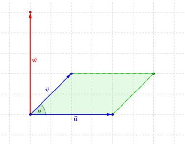
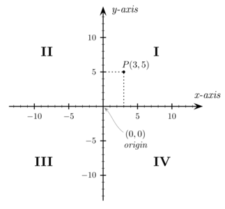

# 13. Souřadnice a vektory

> Zavést kartézskou soustavu souřadnic. Určit vzdálenost dvou bodů a souřadnice středu úsečky. Rozlišit pojmy vektor a jeho umístění. Popsat význam souřadnic vektoru a početní a geometrické určení velikosti vektoru. Definovat a provést operace s vektory (součet vektorů, násobek vektoru reálným číslem, skalární a vektorový součin vektorů). Definovat a určit odchylku dvou vektorů.

# Vektor

### Definice

- Vektor je prvek vektorového prostoru, v němž lze zavést bázi a souřadnice vektoru vzhledem k bázi
- Neformálně: veličina definovaná velikostí a směrem, orientovaná úsečka

### Vlastnosti vektorů

- Vektory $\vec{A}$, $\vec{B}$, $\vec{C}$; skaláry $a$, $b$
- Nulový vektor
  - $\vec{o} = (0,0)$
  - $\vec{A} + 0 = \vec{A}$
  - $\vec{A} \cdot 0 = \vec{o}$
  - $\vec{A}+ (-  \vec{A})= \vec{o}$
- Asociativnost
  - $\vec{A}  + \vec{B}  = \vec{B}  + \vec{A}$
  - $\vec{A} + (\vec{B}  +\vec{C}) = (\vec{A} + \vec{B}  ) + \vec{C}$
  - $a(b \cdot \vec{A}  )= (a \cdot b)\vec{A}$
- Distributivita
  - $(a+b)\vec{A}=a\vec{A}+b\vec{A}$
  - $a(\vec{A} + \vec{B}  )= a\vec{A} + a\vec{B}$

### Vektorové operace

- Vektory $\vec{u} = (u_1;u_2)$, $\vec{v} = (v_1; v_2)$
- Násobení vektoru skalárem (číslem)
  - $a$ - skalár
  - $\vec{u} \cdot a = (v_1 \cdot a ; v_2 \cdot a ) = \vec{w}$
- Součet vektorů
  - $\vec{u}+\vec{v} = (v_1 + u_1; v_2 + u_2) = \vec {w}$
- Skalárním součn
  - $\varphi$ Úhel svíraný vektory $\vec{u}$, $\vec{v}$
  - $\vec{u} \cdot \vec{v} = u_1v_1 + u_2 v_2 + ...+ u_n v_n = |\vec{u}||\vec{v}|\cos(\varphi)$
  - Výsledkem je skalár (číslo)
- Vektorový součin
  - Definován v prostory
  - $\vec{u} = (u_1,u_2,u_3)$, $\vec{v}=(v_1,v_2,v_3)$
  - $\vec{u} \times \vec{v} =(u_2 v_3 - v_2 u_3, u_3 v_1 - v_3 u_1, u_1 v_2 - v_1 u_2) = \vec{w}$
  - $\vec{u} \times \vec{v} = |\vec{u}| \ |\vec{v}| \ \cos(\alpha) = |\vec{w}|$
  - Vektor $\vec{w}$ je kolmý k vektorům $\vec{u}$, $\vec{v}$ , směr se řídí pravidlem pravé ruky
  - Není komutativní $\vec{u} \times \vec{v} \not = \vec{v} \times \vec{u}$
  - Délka vektoru $\vec{w}$ je obsah obrazce mezi vektory $\vec{u}, \vec{v}$

# Soustavy souřadnic

### Kartézská soustava souřadnic

- Souřadnicové osy jsou vzájemně kolmé přímky, které se protínají v jednom bodě
- Pravotočivé a levotočivé soustavy
- 1 Rozměr - Číselná osa
- 2 Rozměry - Rovina
- 3 Rozměry - Prostor

### Polární soustava souřadnic

- Soustava souřadnic v rovině
- Souřadnice $r$ udává vzdálenost bodu od počátku, $\varphi$ úhel spojnice bodu s počátkem a osy souřadnic ($x$)

### Transformace mezi polární a kartézskou soustavou

- $K = [x, \ y]$ - bod v kartézské soustavě
- $P = [r, \ \varphi]$ - bod v polární soustavě
- Z kartézské do polární
  - $r = \sqrt{x^2+y^2}$
  - $\varphi = \arctan(\frac{y}{x}); \ \varphi \in \langle0, \frac{\pi}{2} \rangle$
  - $\varphi=\text{atan2}(y, \ x)$
- Z polární do kartézské
  - $x=r\cos(\varphi)$
  - $\varphi=r \sin(\varphi)$
