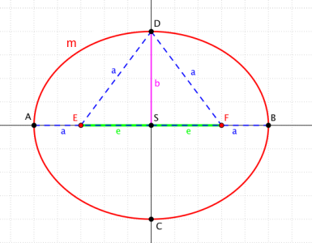

# 14. Kuželosečky, elipsa

## Definice

- Kuželosečka je křivka, která vznikne průnikem roviny s pláštěm rotačního kuželu (rovina neprochází vrcholem kuželu)

## Kružnice

- Vznikne průnikem pláště kuželu s rovinou kolmou na osu symetrie rotačního kuželu
- Viz otázka Kružnice

## Elipsa

### Definice

- Vznikne průnikem pláště kuželu s rovinou, která svírá s osou rotačního kuželu úhel menší než $90°$ a větší než polovina vrcholového úhlu kuželu
- Množina všech bodů s konstatním součetem vzdáleností od dvou bodů - ohnisek

- Elipsa $m$
- Body $E$, $F$ - Ohniska elipsa $l$
- $k \in R^+$ - Konstanta
- Pro bod $X$ elipsy $m$ platí $|XE| + |XF| = k$;

### Pojmy

- Hlavní vrcholy - body $A$ a $B$
- Vedlejší vrcholy - body $C$ a $D$
- Střed - Bod $S$ ve středu úsečky $|EF|$
- Hlavní osa - Přímka, která prochází hlavními vrcholy
- Vedlejší osa - Přímka, která prochází vedlejšími vrcholy

### Analytické vyjádření

- $S = [m; \ n]$ - Střed
- $a$ - Délka hlavní poloosy
- $b$ - Délka vedlejší poloosy
- Hlavní osa rovnoběžná s $o_x$ - $\frac{x^2 - m}{a^2} + \frac{y^2 - n}{b^2} = 1$
- Hlavní osa rovnoběžná s $o_y$ - $\frac{x^2 - m}{b^2} + \frac{y^2 - n}{a^2} = 1$

### Parametrické vyjádření

- $t \in <0, \ 2\pi>$ - parametr
- $x = a \cdot \cos{t}$
- $y = b \cdot \sin{t}$

### Vzorečky

- Excentricita (výstřednost) - $e$
  - Vzdálenost ohnisek od středu elipsy
  - $e = \frac{|EF|}{2} = |ES| = |FS|$
  - $e = \sqrt{a^2 - b^2}$
- Obsah - $S = \pi a b$
- Obvod - $o = 4 a E(e)$; $E$ - Úplný eliptický integrál druhého druhu

## Hyperbola

## Parabola
