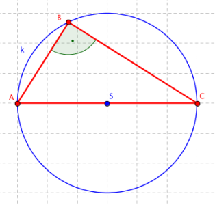

# 15. Kružnice

## Geometrie

### Definice

- Křívka, která má od daného bodu, středu, vždy stejnou vzdálenost
- Rovinný útvar s nejmenším možným obvodem pro daný obsah
- Kuželosečka
- Kruh = Množina bodů složená z kružnice a jejího vnitřku

### Vlastnosti

- Všechny kružnice jsou si podobné
- $r$ - poloměr kružnice
- Obvod - $o_\circ = 2\pi r$
- Obsah - $S_\circ =\pi r^2$

### Vzájemná poloha kružnice a přímky

- Sečna
  - Přímka protíná kružnici ve dvou bodech
  - Vzdálenost přímky od kružnice je menší než poloměr
- Tečna
  - Přímka má s kružnicí jeden společný bod
  - Přímka je kolmá na poloměr
  - Vzdálenost přímky od středu je rovna poloměru
- Vnější přímka
  - Přímka nemá s kružnicí žádný společný bod
  - Vzdálenost přímky od středu je větší než poloměr

### Věty

- Thaletova věta
  - Všechny obvodové úhly sestrojené nad průměrem kružnice jsou pravé
  - Všechny trojúhelníky, jejichž nejdelší stranu půlí střed kružnice opsané, jsou pravoúhlé
  - Sestrojme libovolnou kružnici s průměrem. Koncové body jejího průměru označíme $A$ a $C$ a zvolíme libovolný bod $B$ na kružnici. Pak platí, že trojúhelník $ABC$ je pravoúhlý a má pravý úhel u vrcholu $B$

- Věta o obvodovém a středovém úhlu
  - Zobecnění thaletovi věty
  - Mějme body $A$, $B$ a $C$ na kružnici se středem $S$, potom úhel $\angle{ASC}$ je dvakrát větší než úhel $\angle{ABC}$

- Tětivový čtyřúhelník
  - Existuje kružnice, která prochází body $A, B, C, D$
  - Součet protilehlých úhlů je $180°$

## Analytická geometrie

### Polára

- $k$ - Kružnice se středem v $S = [m; \ n]$ a poloměrem $r$
- $B = [x_0; \ y_0]$ - Bod na nebo vně kružnice $k$
- $p: (x - m)(x_1 - m) + (y - n)(y_0 - n) = r^2$ - polára
- Pokud $B$ leží na kružinici, $p$ je rovnice tečny
- Pokud $B$ leží vně kruřnice, $k \cap p$ jsou body doteku tečen z bodu $B$ na kružnici $k$

### Definice

- Množina všech bodů roviny s konstantní vzdáleností (poloměrem) od bodu (středu)
- $S = [x_0, y_0]$ - Střed
- $r \in R^+$ - Poloměr
- Středová rovnice
  - $(x-x_0)^2+(y-y_0)^2=r^2$
- Parametrické vyjádření
  - $\varphi$ - Proměnný parametr; $\varphi \in \langle2, 2\pi)$
  - $x = x_0+ r \cos(\varphi)$
  - $y = y_0 + r \sin(\varphi)$
