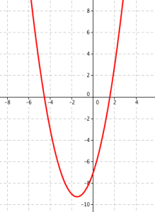

# Parabola a kvadratická funkce a rovnice

> Definovat kvadratickou funkci. Zapsat předpis, zakreslit graf a popsat vlastnosti kvadratické funkce.

> Popsat a použít metody řešení kvadratických rovnic a nerovnic. Parabola jako množina bodů daných vlastností a průnik kuželové plochy s rovinou. Zapsat a rozlišit možná analytická vyjádření a vzájemné polohy paraboly a přímky.

> Užití diferenciálního a integrálního počty při práci s kvadratickou funkcí.

## Kvadratická funkce

### Definice

- $f(x): y = ax^2 + bx + c$ - Kvadratická funkce
- $(a, \ b, \ c \in R ) \land a \ne 0$

### Vlastnosti

- $D(f) = R$
- $H(f)$ - Záleží na konkrétní funkci
- $a > 0$ $\iff$ Konvexní funkce
- $a < 0$ $\iff$ Konkávní funkce
- $b = 0$ $\implies$ Sudá funkce
- Není prostá - "Polo"inverzní funkce odmocnina
- Na polovině $D(f)$ rostoucí, na druhé polovině $D(f)$ klesající

### Analýza

- $f(x): y = ax^2 + bx + c$
- $f'(x): y = 2ax + b$ - Derivací je lineární funkce
- $\int f(x): y = \frac{a^2 x^3}{3} + \frac{b x^2}{2} + cx \ (+ c)$ - Integrálem je kubická funkce
- Hledání vrcholu $V = [x_0; \ y_0]$ pomocí derivace
  - $x_0 = -\frac{b}{2a}$
  - $y_0 = f(x_0)$

## Kvadratické rovnice

### Definice

- Polynomická rovnice 2. řádu
- $ax^2 + bx + c = 0$
- $(a, \ b, \ c \in C ) \land a \ne 0$
- Koeficienty mohou být reálné nebo komplexní

### Řešení kvadratické rovnice (a nerovnice)

- Diskriminantem
  - Diskriminant $D$ - Říká, kolik má polynom kořenů
    - $D > 0$ - Oba kořeny reálné
    - $D = 0$ - Jeden reálný kořen
    - $D < 0$ - Oba kořeny komplexní
  - $D = b^2 - 4ac$ (Pro kvadratickou funkci)
  - $x \in \set{\frac{-b + \sqrt{D}}{2}; \ \frac{-b - \sqrt{D}}{2}}$
- Vietovy vzorce (Pro kvadratickou funkci)
  - $x_1; \ x_2$ - Kořeny
  - $x_1 + x_2 = -\frac{b}{a}$
  - $x_1 \cdot x_2 = \frac{c}{a}$

## Parabola jako kuželosečka

- $\varphi = \alpha$

### Definice

- Vznikne průnikem pláště kuželu s rovinou, která je rovnoběžná s povrchovou přímkoupláště kuželu
- Množina všech bodů s konstantním vzdáleností od bodu (ohniska) a přímky (řídící přímky), na které bod neleží

- Parabola $c$
- Bod $F$ - Ohnisko paraboly $c$
- $d$ - Řídící přímka paraboly $c$
- $|XF| = |XE|$

### Pojmy

- Osa paraboly (přímka $FD$) - Kolmá k řídící přímce, prochází ohniskem
- Vrchol paraboly (bod $V$)
- Parametr paraboly ($p = |FD|$) - Vzdálenost ohniska od řídící přímky

### Analytické vyjádření

- Graf kvadratické funkce
- $V = [m; \ n]$ - Vrchol
- Čtyři různé případy
  - Osa rovnoběžná s $o_y$, zdola omezená
  - $(x - m)^2 = 2 p (y - n)$
  - $F = [m; \ n + \frac{p}{2}]$

- - Osa rovnoběžná s $o_y$, shora omezená
  - $(x - m)^2 = -2 p (y - n)$
  - $F = [m; \ n - \frac{p}{2}]$

- - Osa rovnoběžná s $o_x$, zleva omezená
  - $(y - n)^2 = 2 p (x - m)$
  - $F = [m + ;\frac{p}{2} \ n]$

- - Osa rovnoběžná s $o_x$, zprava omezená
  - $(y - n)^2 = -2 p (x - m)$
  - $F = [m - \frac{p}{2}; \ n]$

