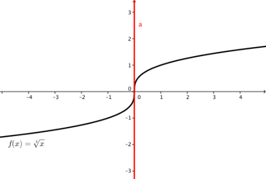

# 23. Diferenciální počet

> Definovat a geometricky interpretovat pojem derivace funkce v bodě. Naznačit odvození vzorců derivací elementárních funkcí. Charakterizovat a užít věty o derivaci součtu, rozdílu, součinu, podílu a derivaci složené funkce.

> Užít derivace k vyšetřování průběhu funkce.

## Derivace

- Derivace funkce v bodě
  - Určuje směrnici těčny funkce v daném bodě
  - $f'(D_x) = \tan{\alpha}$
- Derivace funkce
  - Funkce, která předepisuje směrnici pro obecný argument

### Definice

- Směrnice sečny: $\tan{\alpha} = \frac{|BC|}{|AB|} = \frac{f(b) - f(a)}{b - a}$
- Bod $B$ se postupně přibližuje k bodu $A$ až splynou - vznikne tečna
- Směrnice tečny: $\tan{\alpha} = \lim\limits_{b \to a} \frac{f(b) - f(a)}{b - a}$

- $f$ - funkce
- $f'(x_0) = \lim\limits_{x \to x_0} \frac{f(x) - f(x_0)}{x - x_0}$
- $f'(x_0) = \lim\limits_{h \to 0} \frac{f(x_0 + h) - f(x_0)}{h}$

### Vlastnosti

- Pokud v bodě existuje derivace, je jediná
- Pokud má funkce v bodě derivaci, musí se z prava i leva rovnat
- Když má funkce v bodě derivace, je spojitá (neplatí obráceně)

- Vlastní derivace
  - Derivace je reálné číslo
- Nevlastní derivace
  - Derivace je $\infty$, nebo $-\infty$
  - Tečna s osou $x$ svírá pravý úhel
  - Např. $y = \sqrt[3]{x}$ v bodě $[0; \ 0]$

### Vzorečky

- Základní vzorečky
  - $c' = 0$
  - $x' = 1$
  - $(x^c) = c \cdot x^{c - 1}$
  - $(f_1(x)+f_2(x))' = f_1'(x)+f_2'(x)$
  - $(f(x)\cdot g(x))' = f'(x) \cdot g(x) + f(x) \cdot g'(x)$
  - $(a \cdot f(x))'=a \cdot f'(x)$
  - $(\frac{f(x)}{g(x)})'=\frac{f'(x) \cdot g(x)-f(x)\cdot g'(x)}{g^2(x)}$
  - $(f(g(x)))' = f'(g(x)) \cdot g'(x)$
- Exponenciála
  - $(e^x)'= e^x$
  - $(a^x)'= a^x \cdot \ln{a}$
  - $(\log_a{x})' = \frac{1}{x \cdot \ln{a}}$
  - $(\ln{x})' = \frac{1}{x}$
- Trigonometrie
  - $(\sin{x})'= \cos{x}$
  - $(\cos{x})' = -\sin{x}$
  - $(\tan{x})'= \frac{1}{\cos^2{x}}$
  - $(\cot{x})' = - \frac{1}{\sin^2{}x}$
- Cyklometrie
  - $(\arcsin{x})' = \frac{1}{\sqrt{1 - x^2}}$
  - $(\arccos{x})' = - \frac{1}{\sqrt{1-x^2}}$
  - $(\arctan{x})' = \frac{1}{1+x^2}$
  - $(\text{arccot} \space x)' = - \frac{1}{1+x^2}$

## Průběh funkce

- $f$ - Funkce
- $x \in D(f)$

### Monotonost

- $f'(x) > 0$ - funkce v daném bodě roste
- $f'(x) = 0$ - funkce je v daném bodě konstantní
- $f'(x) < 0$ - funkce v daném bodě klesá

### Konvexnost

- $f''(x) > 0 $ - funkce je konvexní
- $f''(x) = 0 $ - možný inflexní bod
- $f''(x) < 0 $ - funkce je konkávní
- Funkce je konvexní na intervalu$ I $, jestliže pro libovolné dva body $ x < y $ z tohoto intervalu leží část grafu mezi - body  $ (x, f (x))  $ a $ (y, f ( y)) $ pod nebo na úsečce spojující tyto dva body.

- Funkce je konkávní na intervalu $ I $, jestliže pro libovolné dva body $ x < y $ z tohoto intervalu leží část grafu mezi body $ (x, f (x)) $ a $ (y, f ( y)) $ nad nebo na úsečce spojující tyto dva body.

- Definováno vzorcem:
- $ \forall \ a < x < b; \ \frac{f(b)-f(a)}{b-a}(x-a) + f(a) > f(x)$

### Extrémy

- pokud je derivace v bodě $x_0 = 0$	, je podezdřelý z extrému 
- pokud se v bodě $ x_0 $ mění monotonost funkce, je lokálním extrémem (minimem nebo maximem)

### Rovnice tečny

- V bodě $A = [a; \ f(a)]$ má funkce $f$ tečnu $t$
- $t: y = f'(a) \cdot (x - a) + f(a)$
