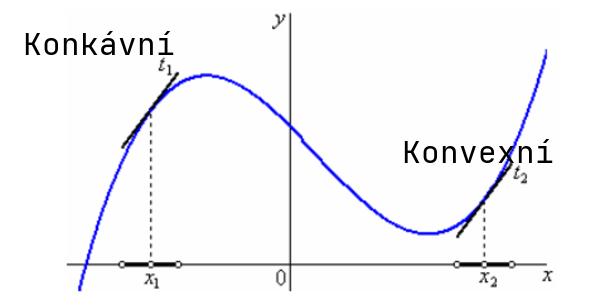

# 23. Diferenciální počet

> Definovat a geometricky interpretovat pojem derivace funkce v bodě. \
> Naznačit odvození vzorců derivací elementárních funkcí. \
> Charakterizovat a užít věty o derivaci součtu, rozdílu, součinu, podílu a derivaci složené funkce. \
> Užít derivace k vyšetřování průběhu funkce.

## Derivace

- Derivace funkce v bodě
  - Určuje směrnici těčny funkce v daném bodě
  - $f'(D_x) = \tan{\alpha}$
- Derivace funkce
  - Funkce, která předepisuje směrnici pro obecný argument

### Definice

- Směrnice sečny - $\tan{\alpha} = \frac{|BC|}{|AB|} = \frac{f(b) - f(a)}{b - a}$
- Bod $B$ se postupně přibližuje k bodu $A$ až splynou - vznikne tečna
- Směrnice tečny - $\tan{\alpha} = \lim\limits_{b \to a} \frac{f(b) - f(a)}{b - a}$

- $f$ - Funkce
- $f'(x_0) = \lim\limits_{x \to x_0} \frac{f(x) - f(x_0)}{x - x_0}$
- $f'(x_0) = \lim\limits_{h \to 0} \frac{f(x_0 + h) - f(x_0)}{h}$

### Vlastnosti

- Pokud v bodě existuje derivace, je jediná
- Pokud má funkce v bodě derivaci, musí se z prava i leva rovnat
- Když má funkce v bodě derivace, je spojitá (neplatí obráceně)

- Vlastní derivace
  - Derivace je reálné číslo
- Nevlastní derivace
  - Derivace je $\infty$, nebo $-\infty$
  - Tečna s osou $x$ svírá pravý úhel
  - Např. $y = \sqrt[3]{x}$ v bodě $[0; \ 0]$

### Rovnice tečny

- V bodě $A = [a; \ f(a)]$ má funkce $f$ tečnu $t$
- $t: y = f'(a) \cdot (x - a) + f(a)$

## Průběh funkce

- $f$ - Funkce
- $x \in D(f)$

### Monotonost

- $f'(x) > 0$ - Funkce v daném bodě roste
- $f'(x) = 0$ - Funkce je v daném bodě konstantní
- $f'(x) < 0$ - Funkce v daném bodě klesá

### Konvexnost

- Konvexní
  - Jestliže pro všechna $x$ z ryzího okolí bodu $x_0$ leží body grafu funkce nad tečnou grafu v bodě $x_0$.
    - $\forall \ a < x < b; \ \frac{f(b)-f(a)}{b-a}(x-a) + f(a) > f(x)$
  - $f''(x) > 0$ - Funkce je konvexní
- Konkávní
  - Jestliže pro všechna $x$ z ryzího okolí bodu $x_0$ leží body grafu funkce pod tečnou grafu v bodě $x_0$.
    - $\forall \ a < x < b; \ \frac{f(b)-f(a)}{b-a}(x-a) + f(a) < f(x)$
  - $f''(x) < 0$ - Funkce je konkávní
  - "Do konkávní funkce kávu nenaleješ"
- Inflexní bod
  - Bod, kde se funkce mění mezi konkávní a konvexní
  - $f''(x) = 0$ - Možný inflexní bod

### Extrémy

- $f$ - Funkce
- $x_0 \in D(f)$ - Bod, kde hledáme extrém
- Pokud se v $x_0$ se mění monotonost funkce, je lokálním extrémem (minimem nebo maximem)
- $f'(x_0) = 0$ $\implies$ stacionární bod
- $f''(x_0) < 0$ - $x_0$ je lokální maximum
- $f''(x_0) > 0$ - $x_0$ je lokální minimum

## Vzorečky

- Základní vzorečky
  - $c' = 0$
  - $x' = 1$
  - $(x^c) = c \cdot x^{c - 1}$
  - $(f_1(x)+f_2(x))' = f_1'(x)+f_2'(x)$
  - $(f(x)\cdot g(x))' = f'(x) \cdot g(x) + f(x) \cdot g'(x)$
  - $(a \cdot f(x))'=a \cdot f'(x)$
  - $(\frac{f(x)}{g(x)})'=\frac{f'(x) \cdot g(x)-f(x)\cdot g'(x)}{g^2(x)}$
  - $(f(g(x)))' = f'(g(x)) \cdot g'(x)$
- Exponenciála
  - $(e^x)'= e^x$
  - $(a^x)'= a^x \cdot \ln{a}$
  - $(\log_a{x})' = \frac{1}{x \cdot \ln{a}}$
  - $(\ln{x})' = \frac{1}{x}$
- Trigonometrie
  - $(\sin{x})'= \cos{x}$
  - $(\cos{x})' = -\sin{x}$
  - $(\tan{x})'= \frac{1}{\cos^2{x}}$
  - $(\cot{x})' = - \frac{1}{\sin^2{}x}$
- Cyklometrie
  - $(\arcsin{x})' = \frac{1}{\sqrt{1 - x^2}}$
  - $(\arccos{x})' = - \frac{1}{\sqrt{1-x^2}}$
  - $(\arctan{x})' = \frac{1}{1+x^2}$
  - $(\text{arccot} \ x)' = - \frac{1}{1+x^2}$
