# 4. Trojúhelník a čtyřúhelník

- $S$ - Obsah
- $o$ - obvod

## Trojúhelník

- Rovinný útvar tvořen třemi úsečkami a třemi vrcholy
- Strany $AB = c$, $BC = a$, $CA = b$
- Úhly $\alpha + \beta + \gamma = 180°$
- $S_\triangle = \frac{a \ v_a}{2}$

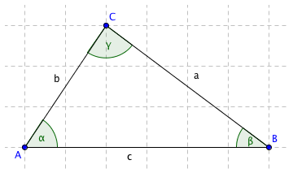

### Pojmy

- Výška - Kolmice na stranu procházející protějším vrcholem
- Těžnice - Spojnice středu strany a protějšího vrcholu

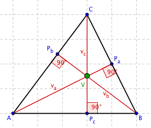

- Ortocentrum (”Výškoviště”)
  - Průsečík 3 výšek
  - Nemusí být uvnitř trojúhelníku

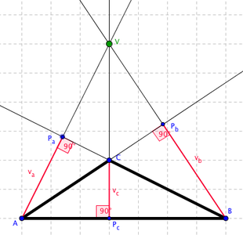

- Těžiště
  - Průsečík 3 těžnic, vždy uvnitř trojúhelníku
  - Dělí těžnice v poměru $1:2$

- Střední příčka
  - Tvoří příčkový trojúhelník, který má identické těžiště s původním trojúhelník

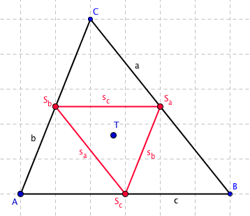

- Kružnice opsaná
  - Střed v průsečíku os stran

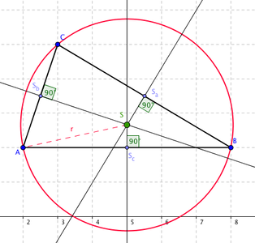

- Kružnice vepsaná
  - Střed v průsečíku os úhlů

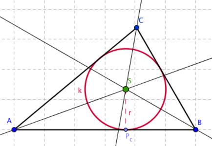

- Kružnice připsaná

  - Dotýká jedné jeho strany a přímek, na nichž leží 2 zbývající strany trojúhelníku
  - Každý trojúhelník má tři kružnice připsané.

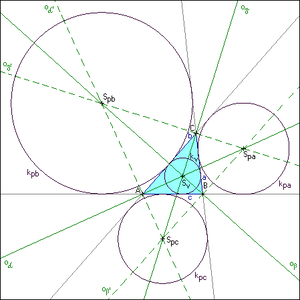

- Trojúhelníková nerovnost
  - $|a|+|b| > |c|$
  - $|a|+|c| > |b|$
  - $|c|+|b| > |a|$

### Typy trojúhelníků

- Rovnostranný trojúhelník

  - $|a|=|b|=|c|;\ \alpha ,\ \beta, \ \gamma \ = 60°$

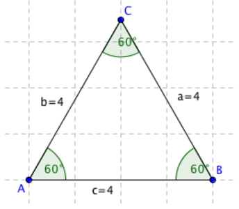

- Rovnoramenný trojúhelník

  - $|a|=|b| \neq |c|; \ \alpha =\beta \neq \gamma$

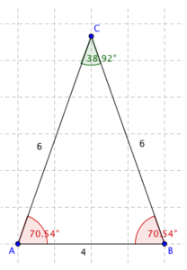

- Ostroúhlý trojúhelník

  - $\alpha, \ \beta, \ \gamma < 90°$

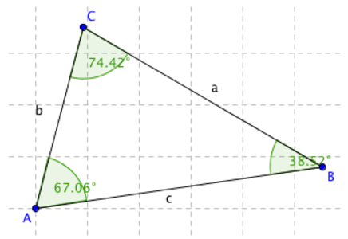

- Pravoúhlý trojúhelník

  - $\alpha \lor \beta \lor \gamma = 90°$
  - $a^2 = b^2 + c^2$

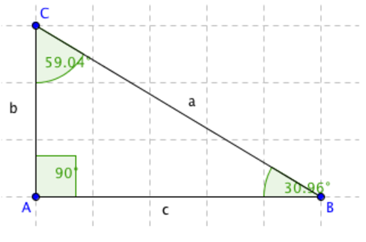

- Tupoúhlý trojúhelník
  - $\alpha \lor \beta \lor \gamma > 90°$

### Vzorečky

- Euklidovi věty
  - Věta o výšce
    - $v_c^2 = c_a \space c_b$
  - Věta o odvěsně
    - $a^2 = c \space c_a$
    - $b^2=c \space c_b$

- Heronův vzorec
  - $a$, $b$, $c$ - délky stran trojúhelníku
  - $s =  \frac{a+b+c}{2}$
  - $S_\triangle = \sqrt{s(s-a)(s-b)(s-c)}$
- Trigoniometrie
  - Sinová věta
    - $ r - \text{poloměr kružnice opsané} $
    - $ \frac{a}{\sin{\alpha}} = \frac{b}{\sin{\beta}} = \frac{c}{\sin{\gamma}} = 2r $
  - Kosinová věta
    - $a^2 = b^2 + c^2 - 2bc \cdot \cos{\alpha}$
    - $b^2 = a^2 + c^2 - 2ac \cdot \cos{\beta}$
    - $c^2 = b^2 + a^2 - 2ab \cdot \cos{\gamma}$
  - Tangentová věta
    - $\frac{a-b}{a+b}=\frac{\tan(\frac{a-\beta}{2})}{\tan(\frac{\alpha+\beta}{2})}$

## Čtyřúhelník

- rovinný útvar tvořen 4 úsečkami a 4 vrcholy
- součet vnitřních úhlů$\space 360°$

### Typy čtyřúhelníků

- Rovnoběžníky
  - $a = c,\ a\|c; \space b = d, \space b\|d \space$
  - $S = ab*\sin{\alpha}$
  - Pravoúhelníky
    - Všechny úhly pravé
    - Čtverec
      - $\alpha, \ \beta, \ \gamma, \ \delta = 90°; \ a = b = c = d $
      - $S_\square = a^2; \space o = 4a;\space u = \sqrt{2}*a$
    - Obdelník
      - $\alpha,\ \beta,\ \gamma,\ \delta = 90° ; \ a = c; \ b = d$
      - $S = a*b; \space u = \sqrt{a^2 + b^2}$
  - Kosoúhelníky
    - Kosočtverec
      - Všechny strany stejně dlouhé
    - Kosodelník
      - Sousední strany různě dlouhé

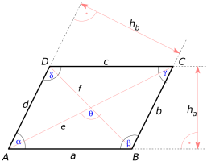

- Lichoběžníky
  - $a\|b$
  - $S = \frac{a+c}{2} * v$

- Různoběžníky

  - $a \not \Vert c,\space b \not \Vert d$
  - Konvexita: $\alpha \lor\beta\lor\gamma\lor\delta \le 90°$

### Tětivový čtyřúhelník

- Existuje kružnice, která prochází body $A, B, C, D$
- Součet protilehlých úhlů je $180°$

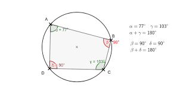
